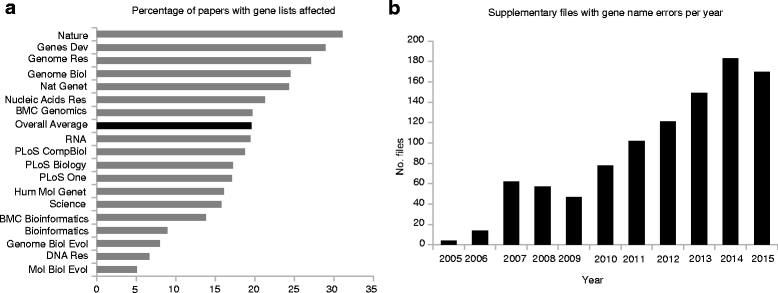
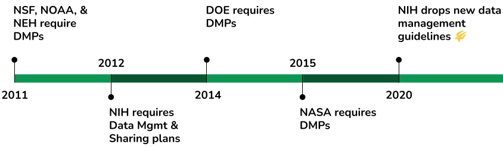
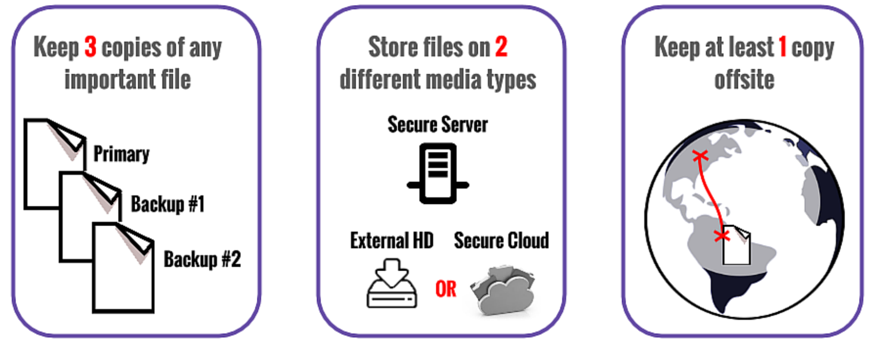
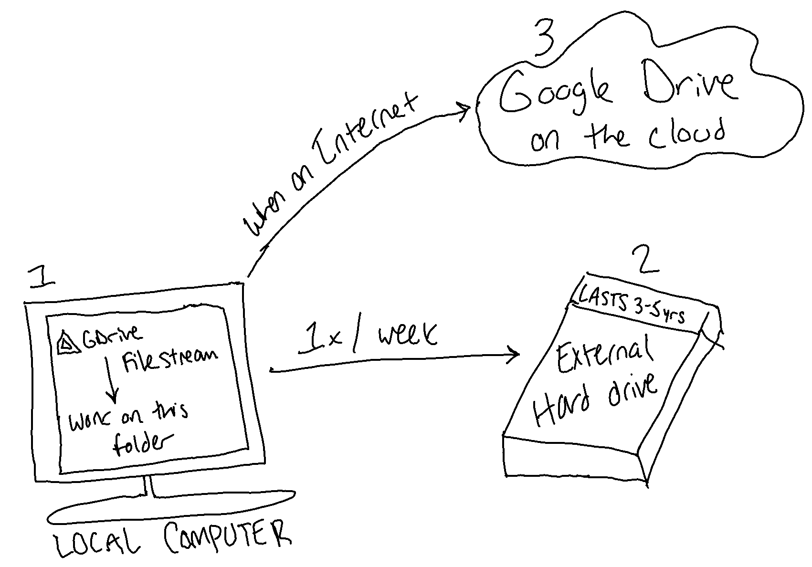
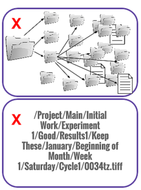
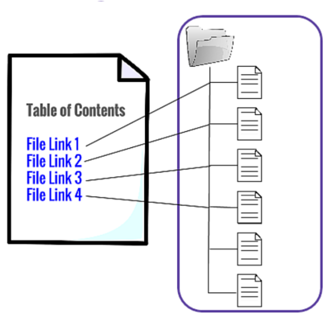
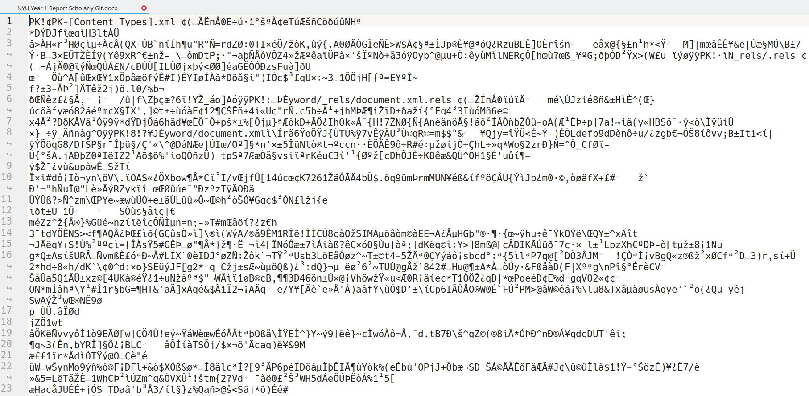

# Basics of Data Management {-}

Research data management is the process of managing the way data is collected, processed, analyzed, preserved, and published for greater reuse by the community and the original researcher. It’s about making research materials findable, organized, documented, and safe, while also making the research process as efficient as possible. 

+ Short-term, RDM helps your streamline your research process and work more sustainably and efficiently
+ Long-term, RDM helps ensure your research is re-usable and understandable so others can build on it (including future you!)

What are the problems RDM tries to solve?

+ Research becoming useless because of:
    - Little or no documentation (codebooks, etc.) about it, so no one but the original researchers can really use it
    - It's in a file format no longer supported by modern computers or software needed to read it is obsolete
+ Research becoming lost because:
    - It’s stored on an old and unstable storage medium (e.g. zip drive)
    - No one wrote down where it is or it wasn’t backed up…people actually just lose it.
    - The "file drawer problem", or -- folks keep it in boxes under desks and then retire or die and no one can understand it (loop back to the first bullet and sub-bullets)

Before we go further, let's define what we mean by data.

> the recorded factual material commonly accepted in the scientific community as necessary to validate research findings.
>
> ---Federal Office of Management & Budget Circular A-110

We're looking at data in a holistic way -- it's not just what comes off of a machine or the result of an analysis, but it also includes the contextual and supporting information generated alongside it necessary to validate it.

Let's start with a video that underscores why research data management is important and highlights some of these issues:

<iframe width="560" height="315" src="https://www.youtube-nocookie.com/embed/66oNv_DJuPc" frameborder="0" allow="accelerometer; autoplay; clipboard-write; encrypted-media; gyroscope; picture-in-picture" allowfullscreen></iframe>

There are some actual real-world examples of what happens when data management isn't present:

+ [Most Scientific Research Data From the 1990s Is Lost Forever](https://www.theatlantic.com/national/archive/2013/12/scientific-data-lost-forever/356422/): A new study has found that as much as **80 percent of the raw scientific data** collected by researchers in the early 1990s is **gone forever**, mostly because **no one knows where to find it**.
     - These are all the studies that you are citing in your work...there is no evidence for the research besides the articles now!
+ [Gene name errors are widespread in the scientific literature](https://genomebiology.biomedcentral.com/articles/10.1186/s13059-016-1044-7): 1/5 of papers with supplementary Excel gene lists (1,000 datasets across over 900 papers) contain erroneous gene name conversions, and **they can't get back to the original data**.

+ [The Availability of Research Data Declines Rapidly with Article Age](https://www.cell.com/current-biology/fulltext/S0960-9822%2813%2901400-0): the odds of the data (when it was reported, e.g. "email me for it") being extant fell by 17% per year -- that means the chances that the data are unrecoverable get to nearly 100% in 5 years! The authors report:

> The major cause of the reduced data availability for older papers was the rapid increase in the proportion of data sets reported as either lost or on inaccessible storage media.

This is not even a new problem with digital data, though more data being digital certainly makes it more susceptible to decay. In an op-ed for Nature Materials, called [Let go of your data](https://www.nature.com/articles/s41563-019-0539-5), the author opens with an anecdote about another time a researcher reached out for data post publication:

> Sometimes scientists just want to see the data. In 1695, Sir Isaac Newton wrote an exasperated letter to the British Astronomer Royal John Flamsteed, whose data on lunar positions he was trying to get for more than half a year1. In that letter Newton declared that “these and all your communications will be useless to me unless you can propose some practicable way or other of supplying me with observations … I want not your calculations, but your observations only.” Flamsteed refused, precipitating lifelong animosity between the two men. 

Because of these horror stories and because they don't want to fund the same projects a million times, many funding agencies have started requiring that researchers submit a 2 page document, a data management plan, with their grant applications that describe how they will care for their data throughout and after the funded project. We're actually 10 years in for requiring DMPs!

If you are working with a PI that has any federal funding, chances are they wrote a DMP for their grant application. I would recommend asking to see it to make sure you abide by what the PI has promised!

So now that I've gone over all the horror stories and reasons why you should care about RDM, let's get into how we can help you avoid these pitfalls!

When you're starting out with a new project, there are some areas you should nail down first before really undertaking your work:

+ [Storage and backup](https://guides.nyu.edu/data_management/storage-backup) procedures (hint: follow the 3-2-1 rule)
+ [File formats](https://guides.nyu.edu/data_management/file-formats) you're going to use throughout the projects (hint: choose open ones!)
+ [Project structure](https://guides.nyu.edu/data_management/file-org) (hint: set a common file naming convention and project folder setup)
+ [Documentation](https://guides.nyu.edu/data_management/documenting-data) plans your data and code, because human memory is the most fallible thing!
+ Determine group roles for RDM activities (if applicable)

## Storage {-}

Let's go through these and what they entail in more detail. The bottom of the RDM pyramid is **storage**. You could have the most efficient and sensical plan and execution for research data management, but if your materials only ever exist on a USB drive...it's not good.

To keep data safe, it is recommended that folks follow the 3-2-1 Rule which dictates you keep 3 copies of your data in various locations:

1. Original copy (on laptop, desktop, etc.)
2. External hard drive in a different physical location from the original (e.g., saved to external hard drive that is periodically updated)
    + The lifetime of an external hard drive is 3-5 years!
3. Secure cloud service

Both Google Drive and Box have desktop applications ([Google Filestream](https://support.google.com/a/answer/7491144?hl=en), [Box Drive](https://www.box.com/resources/downloads)) where folks can mount and access files quickly. When downloaded and installed, the applications create a folder that appears just like a My Documents folder, only it’s connected to your account on whatever service (so it’s Google Drive or Box in your file explorer). Then it operates like a two-way door: changes will be synced to and from your local computer to the service in the cloud.

This helps us stick to the 3-2-1 rule pretty nicely as well:

1. Sync data between local copies (on all my computers) and on the Google Drive server located elsewhere.
    * So this is 2 copies on 2 different storage media, with 1 copy offsite
2. Run the backup to an external hard drive over the Google Drive folder on my laptop whenever there are changes.
    * This brings us to 3 copies on 2 media with 1 offsite copy!

This looks something like this in practice:

NYU storage options:

+ *NYU Drive* for faculty, staff, and students (all-purpose file sharing via Google Apps for Education). Suitable for moderate risk data.
+ *NYU Research Workspace* for faculty, staff, and by request, students, designed for fast access to large datasets. Suitable for moderate risk data.
+ *NYU Box* for faculty, staff, and by request, students, geared towards secure data needs. Suitable for high risk data.
+ *NYU Stream* for faculty, staff, and students, specifically for audio, video, and image files with a focus on collaborative editing and linking with NYU Classes.
+ *NYU High Performance Computing* backups and storage for those already using HPC for a project via the `/archive` data storage. Suitable for moderate risk data.

**A note on restricted data:**

This page can help walk through your choices for working with different types of data throughout a research project: https://www.nyu.edu/research/research-policies/guidelines-for-technology-in-faculty-research.html.

You may also wish to consult NYU's policy on [transmitting and storing sensitive data](http://www.nyu.edu/about/policies-guidelines-compliance/policies-and-guidelines/responsible-use-of-nyu-computers-and-data-policy-on.html) and NYU's [policy on data classification](https://www.nyu.edu/about/policies-guidelines-compliance/policies-and-guidelines/data-classification.html). 

If your project requires a boutique set up, you should fill out this form to get in touch with the Secure Research Data Environment team: https://nyu.qualtrics.com/jfe/form/SV_a5bgfhOWMx3tan3. They are also available by email at srde-support@nyu.edu.

## Project Structure & Documentation {-}

One major issue that researchers run into is not being able to find their files (as we've seen with the horror stories!). I've observed is that folks try to put information about their research projects in their file paths like so:

Imagine trying to send someone that TIFF file on the right -- `0034tz.tiff`. They would not have access to ANY of the information in the file path and probably would not have any context about the file!

Instead of putting your documentation in your file path, it's more efficient instead to put all that contextual information in a **README** file, which is simply a document that describes the files in a folder. It’s really useful when, let’s say, you are trying to go back to some data from 6 months ago and you forget what it is, or why you named a variable XYZ way, or you forget when it was collected. 

READMEs could look like a text file with just a list of file names and a few sentences about the way the file was generated, the variables (if any), and some basic metadata (who made it, when, where, etc.). Others use an HTML file so they see it in-browser and can have links that go the files. 

Some repositories also put out what they’re expecting from researchers in terms of READMEs, such as Dryad: https://datadryad.org/stash/submission_process#metadata. Dryad asks that every data file has their own README, and then collections of data have a group README. This can be useful if you have a data sharing mandante and you already have a repository in mind. If you already maintain a README throughout the project, you won't be wracking your brain to remember everything when it comes time to share the data!

So for documentation, we recommend you at least have these two documents:

+ a *README* file for every folder that describes the files in your folder and explains the naming convention you used
+ a *codebook* that defines specific details of your data  -- the variables, column headers for spreadsheets, participant aliases, or qualitative tags are some examples of facets of a dataset that should be described in a codebook.

It’s useful then to keep a standard way of organizing your projects, to help avoid the nested folder rabbit hole as well. This way of organizing projects I've found is one of the most helpful across different domains of research:

+ Put *each project in its own directory*, which is named after the project and perhaps prepended with that `YYYY-MM-DD` of when the project started.
+ Put text documents and relevant supplementary documentation associated with the project in the `docs` folder.
+ Put raw data and metadata in the `data` folder (which should be ready-only, do not change your raw data directly!)
+ Files generated during cleanup and analysis (like processed data or visualizations) in a `results` folder.
+ Put source for the project’s scripts and programs in the `src` folder.

Visually, it would look like this:

I also wanted to point out that file naming also contributes a LOT to the understandability of your research materials. File naming, when done in a well-organized fashion, can contribute to project documentation, workflow organization, and sharing. Moreover, certain choices in file naming are essential to accessing and sharing files across a computing systems. Some best practices include:

+ Choose file names that are recognizable to humans + machines and that make sense within the project environment
+ Prefix your files with the date created -- ideally use the YYYY-MM-DD format
+ Avoid special characters like `&`, `%`, `$`, `#`, `@`, and `*`. Just use letters and numbers.
+ Do not make file identity dependent on capitalization unless implementing camel case (e.g. `fileName.xml`).
+ Never use spaces in filenames -- many systems and software will not recognize them or will give errors unless such filenames are treated specially. Use an underscore `_` instead
+ Use short file names. For your sake and the sake of systems that'll fail if you give it like a 50 character file name.
+ If you want to use numbering, use `000`, `001` over `0`, `1` because it'll help with sorting once you reach higher numbers.

It's the difference between `VS_IMG%Archive2&3 Jan 2016.tiff` vs `2018-01-04_VS-Archive2-3.tiff`. And it will help you work with files in bulk by allowing for pattern-matching!

There are a few solutions to help people bulk rename files to something consistent:

+ Mac:
    - In the Finder, select and highlight the files you want to change using Shift or Command. Right click/Control + click on the selected files and choose "Rename X Items". Select one of the rename options: swap out text, add a set text, or apply a custom sequential format.
    - [NameChanger](https://mrrsoftware.com/namechanger/)
+ Windows:
    - In the File Manager, select and highlight the files you want to change using Shift or Control. Right click on the selected files and choose "Rename". One of the file names will become active for editing. Enter a systematic file name and press enter. All files will be renamed using the chosen file name and numbered sequentially (1) (2), etc.
    - [Rename It!](https://sourceforge.net/projects/renameit/)

## File Formatting {-}

So, you’ve documented your well-named files. The next thing to look out for is the type of files you’re generating. The gold standard for data and other research output is to choose a format that is open, well-documented, and software agnostic. Remember from that video, that people had to BUY SOFTARE ON EBAY TO GET AT DATA? Don't make us do that for your data in the future, please!

When we say software agnostic, we mean that it can be opened in more than 1 software application and maintain some integrity. This is what a Microsoft Word document looks like when you open it in a text editor, for example:

That is **not** a sustainable format! 

However, we know that different software rely on proprietary file formats. Where possible, it's a best practice to export or convert proprietary files into equivalent open files that will be able to represent that data. In the case of spreadsheets or tabular data, this means that you should keep a master copy of your data as a Comma Separated Value, or CSV file rather than an XLSX, or Excel file.

We list some open formats for common data types on our guide here: https://guides.nyu.edu/data_management/file-formats.

## Summary {-}

Basically, think to yourself:

> if I wanted to use this data in 10 years, what would I need to pack with it to make it useful?

Keep all those things in as open a format as you can, and DOCUMENT IT!
