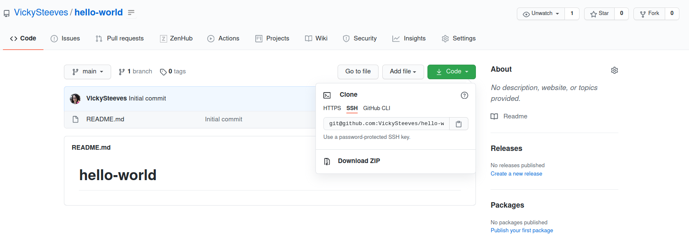
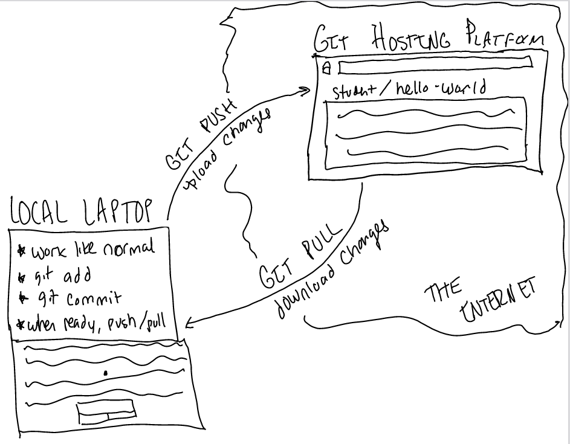

# Intro to Git and GitHub  {-}

A video version of this tutorial can be found here:

<iframe id="kaltura_player" src="https://cdnapisec.kaltura.com/p/1674401/sp/167440100/embedIframeJs/uiconf_id/23435171/partner_id/1674401?iframeembed=true&playerId=kaltura_player&entry_id=1_4t0xxmr2&flashvars[streamerType]=auto&amp;flashvars[localizationCode]=en&amp;flashvars[leadWithHTML5]=true&amp;flashvars[sideBarContainer.plugin]=true&amp;flashvars[sideBarContainer.position]=left&amp;flashvars[sideBarContainer.clickToClose]=true&amp;flashvars[chapters.plugin]=true&amp;flashvars[chapters.layout]=vertical&amp;flashvars[chapters.thumbnailRotator]=false&amp;flashvars[streamSelector.plugin]=true&amp;flashvars[EmbedPlayer.SpinnerTarget]=videoHolder&amp;flashvars[dualScreen.plugin]=true&amp;flashvars[LeadWithHLSOnFlash]=true&amp;flashvars[Kaltura.addCrossoriginToIframe]=true&amp;&wid=1_1o5qi7ly" width="608" height="402" allowfullscreen webkitallowfullscreen mozAllowFullScreen allow="autoplay *; fullscreen *; encrypted-media *" sandbox="allow-forms allow-same-origin allow-scripts allow-top-navigation allow-pointer-lock allow-popups allow-modals allow-orientation-lock allow-popups-to-escape-sandbox allow-presentation allow-top-navigation-by-user-activation" frameborder="0" title="Kaltura Player"></iframe>

## Why version control rules {-}

Version control is "the management of changes to documents, computer programs, large web sites, and other collections of information" (from [Wikipedia](https://en.wikipedia.org/wiki/Version_control)).

Basically, it's a way for us to compare, restore, and merge changes to our stuff. Rather than emailing documents with tracked changes and some comments and renaming different versions of files (example.txt, exampleV2.txt, exampleV3.text) to differentiate them, we can use *version control* to save all that information with the document itself. We want to avoid this:


This makes it **easy to get an overview of all changes made to a file over time** by looking at a log of all the changes that have been made. And all earlier versions of each file still remain in their original form: they are not overwritten, and we can always go back in time to view the contents. So we don't *need* the v3, v4, etc. suffix to our files -- we can just time travel.

The few most important factors of version control are:

* **Collaboration** - When several people collaborate in the same project, it's possible to accidentally overlook or overwrite someone's changes. Version control systems automatically notifies users whenever there's a conflict between one person's work and another's, who then have to decide collaboratively what to keep/overwrite. Using version control systems also helps contribute to open source software, which can be very large-scale collaborations! 
* **Versioning** - Having a robust and rigorous log of changes to a file, without renaming files with suffixes like v1, v2, *final_copy*.
* **Rolling Back** - Version control allows us to quickly undo a set of changes. This can be useful when new writing or new additions to code introduce problems. Since all old versions of files are saved, it's always possible to go back in time to see exactly who wrote what on a particular day.
* **Understanding** - Version control can help you understand how the code or writing came to be, who wrote or contributed particular parts, and who you might ask to help understand it better. We know who to ask if we have questions later on about the codebase!

## What is Git? {-}

**_Git_** is one of the most widely used revision control systems in the world. **Git is not the same thing as GitHub**. Git is a free, open source tool that can be downloaded to your local machine or server and used for logging all changes made to a folder (referred to as a "Git repository" or "repo" for short) over time. Git works the best for plain-text formats like `.csv`, `.py`, `.json`, and more. It cannot version binaries like Microsoft Word documents (`.docx`) nor can it version control PDFs, though both file types can be stored in Git repositories.

Git can be used to control file versions locally by you alone on your computer, but is perhaps most powerful when employed to coordinate simultaneous work on a group of files shared among distributed groups of people. A Git repository contains, among other things, the following:

+ Snapshots of your files (text, images, whatever file that isn't binary)
+ References to these snapshots, called heads

Once installed, interaction with Git is done through the terminal <3 You may be able to interact with Git from your favorite IDE (like VS Code or Atom), but I've found that working with Git on the terminal is a more transferable skill to have. You can pick up a terminal on any type of machine you will likely ever need to work with, but you may not always have access to your favorite IDE (sorry 😓).

### How Git controls versions {-}

Git works on branches, which represent independent lines of development. Each snapshot of files is linked to the 'parent' snapshot that it is built upon. By default, everyone's repositories are on a "main" branch, also called a trunk in other version control systems -- because all branches come from it. When you make a new repository on GitHub, as of October 1 2020, the default branch is "main" so we'll be working with that terminology to keep it all consistent. We'll learn more about branches later in the tutorial, and for now let's just examine how Git works.

There are three states that the files in your repository can be in locally:

1. You are just working normally in your *working directory*.


2. You move files to the *staging area* so Git knows it could potentially become the next version.


3. After you commit to your changes, they become the newest version in *the repository*!


As you work, you move between these three states many, many times throughout the life of a project. These are done with some short commands in the terminal which we'll go over today!


Ok so now that you have a feel for the basics of Git, let's move onto the practical part of the session and get on the terminal!

### Configuring Git locally {-}

Before being able to use Git at all on your computer for fun stuff, you first need to configure Git with your name and email address. In a project, everyone needs to see what exactly other collaborators have been doing. In a version control system like Git, this is done through minimum two commands run in the terminal.

In your terminal window, type:

~~~
$ git config --global user.name 'Your Name'
~~~

And substitute 'Your Name' for your given name and your family name. Hit enter when after you've typed the full line. Nothing should output, that's fine. Next, type the following:

~~~
$ git config --global user.email 'your@email.com'
~~~

Substituting `your@email.com` with your email address, preferably the one you use with your GitHub account (so your commits are verified). Nothing should output after this, that's fine. You could stop here and still use Git, or you could add the next two configurations to help make your Git life easier. Next, we'll need to tell Git which text editor we favor in case we ever need to deal with merge conflicts.

~~~
$ git config --global core.editor "vim"
~~~

Substituting 'vim' for your favorite plain text editor. This could be simply Notepad (Windows) or TextWrangler (Mac), but NOT Microsoft Word, LibreOffice Writer, or other rich text editors. We need it to be as plain as can be!

And one more thing before we stop configuring Git is to set it so that our local program, Git, has our main branch named the same as in GitHub, literally "main". We do that with this: 

~~~
$ git config --global init.defaultBranch main
~~~

At any point in the process, you can double check everything you've just put in with:

~~~
$ git config --list
~~~

This should output something like this:

~~~
vicky@cagliostro:~$ git config --list
user.name=Vicky Steeves
user.email=victoriaisteeves@gmail.com
core.editor=vim
init.defaultbranch=main
~~~

Sometimes Windows and macOS add in their own configurations, so if your list is longer than this, don't worry about it. Always remember that if you forget a `git` command at any point, you can access the list of commands by using `-h` flag and access the Git manual by using `--help` argument. 

~~~
$ git -h
$ git --help
~~~

If there is a wall of text and you get panicky, just hit `Q` and it will quit out of the manual!

## Collaborations with GitHub {-}

Back in the day, collaborating with Git meant emailing repositories around to each other, or hosting it on a server only accessible with the terminal. Today, we have Git hosting platforms, which are websites where you can upload a copy of your Git repository and work openly and collaboratively with others.

At some point, you are definitely going to want to put your work on a Git hosting platform. There are many platforms that host git repositories (like the one holding these materials, which is GitLab!); I've listed the most popular four below:

```{r ghp_table, echo=FALSE}
hosting <- data.frame(
   Name = c ('GitLab', 'GitHub', 'BitBucket', 'SourceForge'), 
   Manager = c("GitLab B.V.","Microsoft","Atlassian","BizX LLC"),
   Est. = (c("2011", "2008", "2008", "1999")),
   Free_Software = (c('Yes (partial on server)', 'No', 'No', 'Yes')),
   Open_Source = (c('Yes', 'No', 'No', 'No')),
   Private_Repos = (c('Yes', 'Paid', 'Yes', 'No')),
   Ad_Free = (c('Yes', 'Yes', 'Yes', 'No'))
)
```

```{r ghps, echo=FALSE}
knitr::kable(hosting, booktabs = TRUE,
  caption = 'A comparison of the four most popular git repo hosting platforms.'
)
```

Since we are using Git and Git doesn't really care where a remote copy of your repository is, no matter where you choose to host your repositories, the commands are the same! So you can defer to your collaborators, or make the case for a hosting platform you feel strongly about. For this session, we're using GitHub.

### Create a Repo on GitHub {-}

The workflow for how you start with a Git repository and syncing it with GitHub will be different, depending on your use case. For now, please create a new repository called `hello-world` in GitHub's web interface. It should look something like this:


Check off "initialize with a README". Everything should look like this before you hit the big green `Create Repository` button:


Click `Create Repository` and you'll be brought to a fresh repository. If you have a collaborator, go to the repository settings (click the `Settings` tab in your repository or go to: `https://github.com/<username>/hello-world/settings/access`) and then invite your collabs to have access to the repository. They will need to go to their email to accept the invitation.

### Downloading the repository {-}

Ok, so now that we have a repository to work on, let's get to it! To bring our central repository to our local computer, we can `clone` it. On GitHub, click the big green `Code` button and click `HTTPS`. Then copy the link that it gives you. **Do not** download ZIP.



After that, open the terminal, and navigate to your Desktop using  (or anywhere that you will be able to find on the terminal) `cd`. After you are in a good place, clone the repository by pasting the link after the commands `git clone` like so:

~~~
git clone https://github.com/VickySteeves/hello-world.git
~~~

After that finishes downloading our repository, `cd` in the newly created folder with:

~~~
cd hello-world/
~~~

Now I want to bring something to your attention. Try typing and entering this command in your hello-world folder on the terminal:

~~~
vicky@cagliostro:~/Downloads/hello-world$ ls -a 
~~~

If you did that, you have found the `.git` repository!! It is a hidden sub-folder in your project folder. You probably won't have to touch this ever, but *definitely* don't delete it or your history is GONE. Leave it hidden!

## Version Local Files with Git {-}

Now that we've cloned our GitHub repository to our computers, let's see how Git works locally. Here you can use a basic 2 step workflow to keep track of your changes with Git. Changes must first be **add**ed to the staging area, then **commit**ted from there. This two-stage process gives us a lot of control over what should and should not be included in a particular commit. This is the workflow you'll use over and over again locally:

1. `git add filename.extension`
2. `git commit -m 'super descriptive commit message'`

These two commands, `git add` and `git commit`, are required to record all our local changes. These help us track a single file (e.g. `git add README.md`), a select group of files (e.g. `git add *.csv`), or *everything* (e.g. `git add .`) in the repository.

Ok so let's make some changes to our repository so we can practice learning with Git. I've found that having a consistent folder organization scheme is commonly useful -- here is one that I use in my work:

+ Put text documents associated with the project in the `doc` folder.
+ Put raw data and metadata in the `data` folder. These data are **read-only**!
+ Files generated during cleanup and analysis in a `results` folder.
+ Put any code or scripts for the project in the `src` folder.

And while we're at it, some file naming best practices:

+ Name all files to reflect their content or function, with NO special characters (!@#$%^*) or spaces! Use underscores or dashes, A-Z, and numbers!

So anyway, let's make some of these folders using the terminal, and then put some text in them to `add` and `commit`  with Git!

~~~
mkdir docs/ results/ data/ src/
~~~

Now use the `ls` command to see if that worked. You should see something like this in your terminal:

~~~
vicky@cagliostro:~/Downloads/hello-world$ ls
data  docs  README.md  results  src
~~~

### Collaborating? Make a branch! {-}

If you are working collaboratively, you will want to avoid merge conflicts at any cost because they are really annoying to deal with. So we are going to work on `brach`es. A Git `branch` represents an independent line of development that will likely someday be merged back into `main`.

When you work collaboratively, you should work on a branch. The only thing you should commit directly to `main` are like typos in the README or fixing broken links. Otherwise, you should work on a branch, and then submit a pull request to the repository, even if you are a collaborator on it. Using this workflow helps to make sure your changes don't conflict with the rest of the work in the repo.

So let's make a new branch:

~~~
git checkout -b <any-short-name>
~~~

This is what my output looks like from creating a branch to brainstorm research ideas on:

~~~
vicky@cagliostro:~/Downloads/hello-world$ git checkout -b brainstorm
Switched to a new branch 'brainstorm'
~~~

Now I can go through the same Git and GitHub workflows as usual, just on this branch instead of `main`. You can always go back to any branch by using the command `git checkout <branch-name>`. 

### Tracking the changes {-}

So now that we have our repository structure set, let's create a file that we want to track with Git! Open up a plain text editor (Vim, Nano, Notepad, Notepad++, TextWrangler, Sublime Text...whichever plain text editor you want) and create a file:

1. Open your plain text editor.
2. Write out the beginning of a research idea. Just a few lines is fine.
3. Save this file as `ideas.txt` in the `docs` folder you just created.
4. Go back to the terminal.

Now let's make sure we did that right by going to our terminal and typing in Vicky's favorite Git command:

~~~
git  status
~~~

This `status` will tell us that Git has noticed a new file in our directory that we are not yet tracking -- the directory where you each saved your text file should be red. We now want to tell Git that we want to track any changes to that directory with `git add`. This adds the folder and our `txt` file to the **staging area** (where Git checks for file changes). Type the following as separate commands:

~~~
$ git add <folder-name>
$ git status
~~~

The directory name should be green now, which is Git visually cueing us to the fact that there is a new file waiting for us to `commit` to it! 

A `commit` records changes to the repository, and is assigned a unique hash that users can leverage for many purposes, like reviewing the history of changes to a repo! The messages we attach to our commits are therefore **extremely important**. Past us can't answer emails about our code, and if you want to go through a timeline of development history that only says "updated code" ... well chances are you're not gonna have a good time.

A good commit message is concise, descriptive, and informative. Good commit messages start with verbs in the present tense and aim to be 50 characters or less (and try to avoid screaming!).


Since we think it's fine for a first draft, we can **commit** to our new version of the text file: 

~~~
git commit -m 'short descriptive message about activities'
~~~

### Viewing and rewriting history {-}

Another great part of Git is that it tracks that rich historical information. To review what you've been up to, type this in the terminal:

~~~
$ git log
~~~

This will list your commits with their IDs, date/time of creation, associated person, and commit messages. We should have 3 commits right now for our `hello-world` repository.

If you want to only look at the changes to a specific file, enter this command in the terminal:

~~~
$ git log filename.extension
~~~

This will list changes as before, but only those affecting this file, such as the one we just created! Remember that weird number from git log next to commits? This unique hash allows you to refer to that version, and you can use it to view the differences between files and repository states, as well as rewrite and overwrite your history.

## Uploading changes to GitHub {-}

**At the moment our changes are only recorded locally, on our computer. If we wanted to share the link to GitHub with anyone, or work collaboratively with someone else, there would have no way of seeing what you've done.**

So to make sure that our work is on GitHub as well as locally on our computers, we will then have to upload, or `push` our local changes to the GitHub repository. We do this using the `git push` command:

~~~
$ git push -u origin <branch-name>
~~~

The nickname of our remote repository is `origin` (you can link of origin like a variable that holds the URL to our GitHub repository) and the default branch name is `main`. The `-u` flag tells Git to remember the parameters, so that next time we can simply run `git push` and Git will know what to do.

You may be prompted to enter your GitHub username and password to complete the command, and do so. If you are collaborating with others on a repo, pay attention to the terminal as you may see a URL in there that you will need to use as a part of our collaboration. This is what my output looks like -- you can see below a link to create a pull request on GitHub. By holding down `CTRL`, I can click that link. A browser window will open for me to make a pull request, which is exactly what I would do if I was collaborating with someone else! If I was working individually, I'd ignore it.

~~~
vicky@cagliostro:~/Downloads/hello-world$ git push origin brainstorm 
Enumerating objects: 5, done.
Counting objects: 100% (5/5), done.
Delta compression using up to 8 threads
Compressing objects: 100% (2/2), done.
Writing objects: 100% (4/4), 369 bytes | 369.00 KiB/s, done.
Total 4 (delta 0), reused 0 (delta 0)
remote: 
remote: Create a pull request for 'brainstorm' on GitHub by visiting:
remote:      https://github.com/VickySteeves/hello-world/pull/new/brainstorm
remote: 
To github.com:VickySteeves/hello-world.git
 * [new branch]      brainstorm -> brainstorm
~~~

**If you are working collaboratively and started a pull request by clicking that link**, you will have to fill in some information about the text that you have changed in your repository, whether it's documentation, new data, or new code. You should replace whatever pre-filled title there is with a more descriptive one, and write out an explanation of what you did in the discussion box. You can apply labels to pull requests as well. When you have done all that, click the `Create pull request` button. A pull request is a like a 'submission' to a repository that is either accepted or closed by the maintainers (people who can push directly to the repository). It has a discussion feature, a review feature, and can connect to issues. It's helpful to discuss specific work that is done or ongoing (you can have 'draft' PRs).

Now, your collaborator will need to merge that in. Since you both worked on totally different parts of the repository, you should be able to merge those in without a problem! So, each of you merge in the other one's pull request. To do that:

1. Go to the `Pull Requests (2)` tab in your collaborative repository
2. Click on the PR that you did not write.
3. Click the `Files` tab in that PR to check out and verify your colleague's work
4. Go back to the `Discussion` tab in that PR and scroll down to click the big green `Merge` button

This brings me to a good best practice though -- you should really not be merging in your own pull requests, again unless they are small (in which case honestly just push to `main`). Also, if you are working solo, you really don't even need to push the changes to GitHub without first merging the branch into `main` (which is possible through Git in the terminal). That way you can work on branches and not mess up any code you know works on `main` and still not go through a weird self-submitting-and-accepting-PR cycle.

## Downloading changes from GitHub {-}

There will be times when you will have changes that are in GitHub that are not reflected locally on your computer. This might happen for a number of other reasons, like you might have to work on two different computers and stay synced between them (this happened to me a lot when I used go from my work computer to my home computer).

To **download** changes from a remote repository, we use the opposite of `push` ↪️ `pull`! Literally just type out:

~~~
$ git pull
~~~

So with `git pull` you can remain totally N*Sync between your local computer and GitHub!

## Workflow overview {-}

For collaborations:

1. Make a repository on GitHub
2. Give your collaborators access to that GitHub repository.
3. Each of you write out issues for the project work
4. Assign yourself an issue
5. Clone the repo to your local computer.
6. Create a branch, then work as normal `add`ing and `commit`ing files as you work
7. Push your work to a pull request, which can be on `draft` mode if you are still working (so no one can merge it in prematurely)
8. Make sure you also `pull` the repository frequently to make sure you are always working with the most up-to-date version of the repository there is.

For individuals:

1. Make a repository on GitHub
    - you can also write issues or use the project boards for organization, though it's more for your benefit than anyone else's
2. Clone it to your local computer.
3. Work as normal, `add`ing and `commit`ing files as you work
4. Push to GitHub minimum 1x/day but preferably like twice before and after lunch
* If anyone wants to collaborate with you, they will need to fork your repository before making a pull request.



## Organizing in GitHub {-}

I wanted to point out some neat features that GitHub has that can help you organize your group work, or even yourself (I use all these myself just to help me remember things!).

### README {-}

There are a few key things everyone needs in their repository that are generally useful. The first important file is the `README.md` file. A README file broadly contains information about other files in a directory. GitHub made us one by default earlier. It is usually in a plain text format, like markdown (`.md`) or text (`.txt`). A good README contains:

| HEADING                | CONTENTS                               | QUESTIONS TO ANSWER    |
|--------------------|-----------------------------------------------------------------|-------------------------------------------------------------------------------------------------------------------------------------------|
| TITLE/SUMMARY          | General information                    | What does your project do? How is it used? Share your vision! |
| AUTHORS                | Credits for maintainers                | Who is responsible for this project? | 
| GETTING STARTED        | Installation & dependency instructions | If someone were to pick up your project today, what dependencies would they need to install to get it to work? |
| LICENSE                | Copyright and licensing information    | How can others extend, use, remix, and distribute your work? Is there a particular citation format to use? |
| CONTRIBUTING           | Guide for prospective contributors     | How can others help? Make it easy for others to get involved by letting them know how to submit new features, report issues, or offer other assistance. |
| THANKS                 | Acknowledgments                        | OSS can sometimes be thankless. Don't be that person! Acknowledge the entities who help you. You can even provide a link to your [say thanks inbox](http://saythanks.io/) to pay that effort forward |

### LICENSE {-}

The second one is to **choose a license** and add it to your repository as a `LICENSE` file (no extension). Choosing a license is an important part of openly sharing your work online and can help let people know how they can use your work -- for example, do you want others to be able to modify your code and redistribute it? For many of the open source tools we rely on, it would be *impossible* to do our work without the code authors and maintainers using a license that outlines those provisions. If there is no license, you must assume All Rights Reserved, which means you can see and run the code, but not much else.

For help in wading through the many types of open source licenses, please visit [https://choosealicense.com/](https://choosealicense.com/).

### Issues {-}

Issues help you keep track of the work happening on your project - they act much like a to-do list mixed with a discussion forum. In GitHub (and most GHPs), you can link to specific commit messages or pull requests, or even close issues with specific relevant commits.

I highly recommend that during collaborative work, some of that planning involves writing and posting issues. Issues typically have:

+ A title and description describe what the issue is all about.
+ Color-coded labels help you categorize and filter
+ A milestone acts like a container for issues (I use a conference name as a milestone for instance!)
+ Comments allow anyone with access to the repository to provide feedback (if your repo is public, anyone can comment)

When this is done and you all are ready to work, you then would **assign yourself** to the issue that you are currently working on. That way we all know what the other is doing. Issues can also be connected to pull requests, where collaborators can directly provide feedback on that work. I'll go over that in a bit.

I love issues because they often contain some explanation of decisions over the course of a project and are a great way to coordinate with others.

### Wikis {-}

Every GitHub repository comes with a Wiki. You can disable that in the repository settings, however Wikis are useful for documentation. I use Wikis as lab notes and as a place to keep meeting minutes for projects that I am working on -- mostly administrative stuff. Most of the time, developers use the Wiki as the main source of documentation about the software the repository contains. That can also be useful for you, as you'll need to document your research along the way 😁

### Projects {-}

This is a Kanban-board like organization tool that is built into GitHub as well, sort of like Trello but with some GitHub specific actions and integrations. Folks use these to make roadmaps (to a first version of a software, or to a finished conference paper) and to keep track of a project (using the `To Do`, `In Progress`, `Review`, and `Done` column setup). From [GitHub's docs](https://docs.github.com/en/free-pro-team@latest/github/managing-your-work-on-github/about-project-boards):

> These boards issues, pull requests, and notes that are categorized as cards in columns of your choosing. You can drag and drop or use keyboard shortcuts to reorder cards within a column, move cards from column to column, and change the order of columns. Project board cards contain relevant metadata for issues and pull requests, like labels, assignees, the status, and who opened it. You can view and make lightweight edits to issues and pull requests within your project board by clicking on the issue or pull request's title.

I also like that you can create notes in columns that can serve as reminders and general useful references (you can even create a reference card for another project board by adding a link to a note, which is really useful for working across repositories!).

I find the setup helpful, especially for folks that prefer to see all the GitHub issues listed out at once (which is kind of hard to do in the list view).